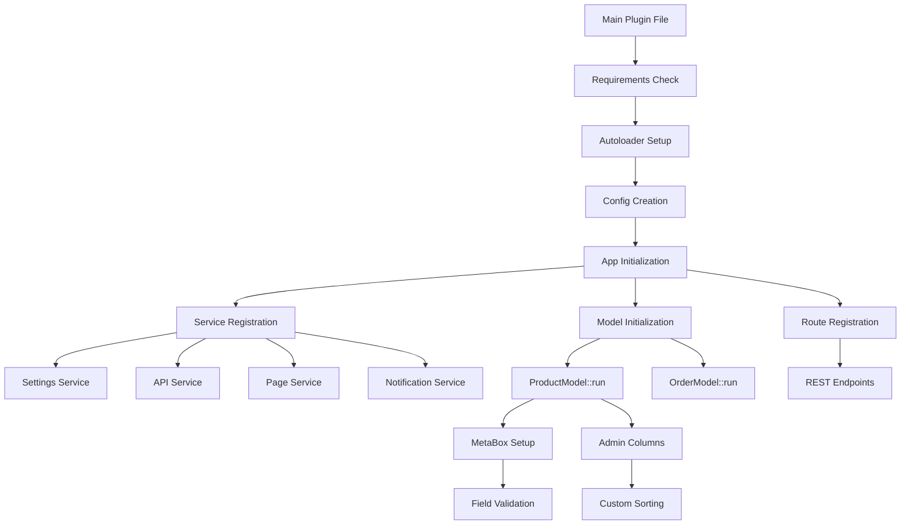

# WPToolkit Best Practices

## Table of Contents
1. [Core Architecture Pattern](#core-architecture-pattern)
2. [Project Structure](#project-structure)
3. [Dependency Management](#dependency-management)
4. [Model Implementation](#model-implementation)
5. [REST API Implementation](#rest-api-implementation)
6. [Settings Management](#settings-management)
7. [View Rendering](#view-rendering)
8. [Theme vs Plugin Strategy](#theme-vs-plugin-strategy)
9. [Performance Optimization](#performance-optimization)
10. [Security Practices](#security-practices)
11. [Error Handling & Debugging](#error-handling--debugging)
12. [Testing Strategy](#testing-strategy)
13. [Mandatory Implementation Checklist](#mandatory-implementation-checklist)

---

## 1. Core Architecture Pattern

### Central App Class (Recommended)
The App class serves as your application's dependency injection container with type safety and performance benefits.

```php
namespace MyPlugin;

use Codad5\WPToolkit\Utils\{Config, Settings, Page, Notification, RestRoute};
use Codad5\WPToolkit\Registry;

final class App {
    private static ?Config $config = null;
    private static ?RestRoute $api = null;
    private static ?Settings $settings = null;
    
    public static function init(Config $config): void {
        self::$config = $config;
        
        // Register with global registry for cross-app communication
        Registry::registerApp($config);
        
        // Initialize core services
        self::initializeServices();
        self::registerRoutes();
        self::initializeModels();
    }
    
    private static function initializeServices(): void {
        // Settings service with validation
        self::$settings = Settings::create([
            'api_key' => [
                'type' => 'password',
                'label' => __('API Key', 'textdomain'),
                'required' => true,
                'validate_callback' => fn($v) => !empty($v) ?: 'API key required'
            ]
        ], self::$config);
        
        // REST API with versioning
        self::$api = RestRoute::create(self::$config, ['v1', 'v2'], 'v1');
        
        // Register all services with Registry
        Registry::addMany(self::$config, [
            'settings' => self::$settings,
            'api' => self::$api,
            'page' => Page::create(self::$config, self::$config->path('templates')),
            'notification' => Notification::create(self::$config, self::$config->get('name'))
        ]);
        
        // Setup lazy-loaded services
        Registry::factory(self::$config->slug, 'cache', fn($config) => 
            new CacheService($config)
        );
    }
    
    private static function registerRoutes(): void {
        // Auto-documentation endpoint
        self::$api->get('v1', '/docs', fn() => self::$api->getApiDocumentation());
        
        // Resource endpoints with proper REST conventions
        self::$api->get('v1', '/products', [ProductController::class, 'index']);
        self::$api->post('v1', '/products', [ProductController::class, 'store']);
        self::$api->get('v1', '/products/(?P<id>\d+)', [ProductController::class, 'show']);
        self::$api->put('v1', '/products/(?P<id>\d+)', [ProductController::class, 'update']);
        self::$api->delete('v1', '/products/(?P<id>\d+)', [ProductController::class, 'destroy']);
    }
    
    private static function initializeModels(): void {
        // Initialize models with proper lifecycle management
        ProductModel::get_instance(self::$config)->run();
        OrderModel::get_instance(self::$config)->run();
    }
    
    // Type-safe service accessors
    public static function getConfig(): Config {
        return self::$config ?? throw new \RuntimeException('App not initialized');
    }
    
    public static function getSettings(): Settings {
        return self::$settings ?? throw new \RuntimeException('Settings not initialized');
    }
    
    public static function getApi(): RestRoute {
        return self::$api ?? throw new \RuntimeException('API not initialized');
    }
    
    // Registry shortcuts for convenience
    public static function getService(string $name): mixed {
        return Registry::get(self::$config->slug, $name);
    }
}
```

**Why this pattern?**
- ✅ True dependency injection with type safety
- ✅ 2-3x faster than pure Registry pattern
- ✅ IDE autocompletion and static analysis support
- ✅ Explicit service dependencies and initialization order
- ✅ Easy unit testing with mockable dependencies
- ✅ No global state pollution

### Registry Pattern (Strategic Use Cases)
Use Registry for specific scenarios where the App pattern isn't suitable:

```php
// Cross-plugin communication
Registry::add($config, 'shared_cache', new SharedCacheService());
$cache = Registry::get('other-plugin', 'shared_cache');

// Dynamic service loading
Registry::factory($config->slug, 'payment_gateway', function($config) {
    $gateway_type = $config->get('payment_gateway', 'stripe');
    return PaymentGatewayFactory::create($gateway_type);
});
```

---

## 2. Project Structure

### Plugin Structure (Recommended)
```
my-plugin/
├── my-plugin.php              # Main plugin file
├── composer.json              # Dependencies & autoloading
├── src/                       # PSR-4 autoloaded source
│   ├── App.php                # Central application class
│   ├── Controllers/           # REST API controllers
│   │   ├── BaseController.php
│   │   └── ProductController.php
│   ├── Models/                # Database models
│   │   ├── BaseModel.php
│   │   └── ProductModel.php
│   ├── Services/              # Business logic services
│   │   ├── PaymentService.php
│   │   └── EmailService.php
│   ├── Validators/            # Custom validators
│   ├── Middleware/            # API middleware
│   └── Exceptions/            # Custom exceptions
├── templates/                 # View templates
│   ├── admin/                 # Admin templates
│   ├── frontend/              # Frontend templates
│   └── email/                 # Email templates
├── assets/                    # Static assets
│   ├── css/
│   ├── js/
│   └── images/
├── languages/                 # Translations
├── tests/                     # Unit & integration tests
│   ├── Unit/
│   ├── Integration/
│   └── bootstrap.php
├── docs/                      # Documentation
├── .github/                   # GitHub workflows
└── README.md
```

### Theme Structure (Minimal Logic)
```
my-theme/
├── functions.php              # Theme entry point
├── style.css                  # Theme stylesheet
├── src/                       # Theme-specific logic (minimal)
│   ├── ThemeApp.php           # Central theme class
│   ├── Models/
│   │   └── ThemeOptions.php   # Theme customization only
│   └── Services/
│       └── ThemeService.php   # Display logic only
├── templates/                 # Theme templates
│   ├── parts/
│   ├── layouts/
│   └── pages/
├── assets/                    # Theme assets
└── languages/
```

---

## 3. Dependency Management

### Initialization Sequence (Critical)
```php
// my-plugin.php
declare(strict_types=1);

namespace MyPlugin;

// Prevent direct access
if (!defined('ABSPATH')) {
    exit;
}

// Load Composer dependencies
if (file_exists(__DIR__ . '/vendor/autoload.php')) {
    require_once __DIR__ . '/vendor/autoload.php';
}

use Codad5\WPToolkit\Utils\{Autoloader, Config, Requirements};

// 1. Configure autoloader (MANDATORY - before any class usage)
Autoloader::init([
    'MyPlugin\\' => __DIR__ . '/src/',
    'MyPlugin\\Tests\\' => __DIR__ . '/tests/'
]);

// 2. Check requirements before initialization
$requirements = new Requirements();
if (!$requirements->php('8.1')->wp('6.0')->met()) {
    add_action('admin_notices', function() {
        echo '<div class="error"><p>MyPlugin requires PHP 8.1+ and WordPress 6.0+</p></div>';
    });
    return;
}

// 3. Create configuration (MANDATORY)
$config = Config::plugin('my-plugin', __FILE__, [
    'name' => 'My Plugin',
    'version' => '1.0.0',
    'environment' => WP_DEBUG ? 'development' : 'production',
    'text_domain' => 'my-plugin'
]);

// 4. Initialize application (MANDATORY)
add_action('plugins_loaded', function() use ($config) {
    MyPlugin\App::init($config);
});

// 5. Activation/deactivation hooks
register_activation_hook(__FILE__, function() use ($config) {
    MyPlugin\Installer::activate($config);
});

register_deactivation_hook(__FILE__, function() use ($config) {
    MyPlugin\Installer::deactivate($config);
});
```

### Service Access Patterns
```php
// Inside your plugin code
class ProductController {
    public function index(WP_REST_Request $request): WP_REST_Response {
        // Method 1: Direct static access (fastest)
        $settings = App::getSettings();
        
        // Method 2: Registry access (for cross-service dependencies)
        $cache = App::getService('cache');
        
        // Method 3: Direct model access
        $model = ProductModel::get_instance(App::getConfig());
        
        return App::getApi()->successResponse($model->get_posts());
    }
}
```

---

## 4. Model Implementation

### Best Practices for Models

**✅ DO:**
```php
class ProductModel extends Model {
    protected const POST_TYPE = 'product';
    
    // ✅ Use before_run() for all initialization
    protected function before_run(): void {
        $this->setup_metaboxes();
        $this->setup_admin_columns();
        $this->set_caching(true, 3600);
        
        // Setup custom capabilities if needed
        $this->setup_capabilities();
    }
    
    // ✅ Define comprehensive post type arguments
    protected static function get_post_type_args(): array {
        return [
            'labels' => [
                'name' => __('Products', 'textdomain'),
                'singular_name' => __('Product', 'textdomain'),
                'add_new_item' => __('Add New Product', 'textdomain'),
            ],
            'public' => true,
            'has_archive' => true,
            'show_in_rest' => true,
            'supports' => ['title', 'editor', 'thumbnail', 'custom-fields'],
            'capability_type' => 'product',
            'map_meta_cap' => true,
        ];
    }
    
    // ✅ Define admin columns with proper configuration
    protected function get_admin_columns(): array {
        return [
            'price' => [
                'label' => __('Price', 'textdomain'),
                'type' => 'currency',
                'sortable' => true,
                'metabox_id' => 'product_details',
                'field_id' => 'price',
                'callback' => fn($value) => '$' . number_format($value, 2)
            ],
            'stock_status' => [
                'label' => __('Stock', 'textdomain'),
                'type' => 'badge',
                'sortable' => false,
                'callback' => [$this, 'render_stock_status']
            ]
        ];
    }
    
    // ✅ Comprehensive MetaBox setup
    private function setup_metaboxes(): void {
        $metabox = MetaBox::create('product_details', __('Product Details', 'textdomain'), self::POST_TYPE, $this->config)
            ->add_field('price', __('Price', 'textdomain'), 'number', [
                'min' => 0,
                'step' => 0.01
            ], [
                'required' => true,
                'sanitize_callback' => 'floatval',
                'validate_callback' => fn($v) => $v > 0 ?: __('Price must be greater than 0', 'textdomain')
            ])
            ->add_field('sku', __('SKU', 'textdomain'), 'text', [], [
                'required' => true,
                'sanitize_callback' => 'sanitize_text_field',
                'validate_callback' => [$this, 'validate_unique_sku']
            ])
            ->set_caching(true, 1800)
            ->onSuccess(function($post_id, $metabox) {
                // Clear related caches
                wp_cache_delete("product_{$post_id}", 'products');
                wp_cache_delete('product_list', 'products');
                
                // Trigger hooks for integrations
                do_action('product_updated', $post_id, $metabox->all_meta($post_id));
            })
            ->onError(function($errors, $post_id, $metabox) {
                error_log("Product save failed for post {$post_id}: " . print_r($errors, true));
            })
            ->setup_actions();
            
        $this->register_metabox($metabox);
    }
    
    // ✅ Custom validation methods
    public function validate_unique_sku($value, $field, $post_id): bool|string {
        if (empty($value)) {
            return __('SKU is required', 'textdomain');
        }
        
        $existing = $this->get_posts([
            'meta_query' => [
                [
                    'key' => 'sku',
                    'value' => $value,
                    'compare' => '='
                ]
            ],
            'post__not_in' => [$post_id],
            'posts_per_page' => 1
        ]);
        
        return empty($existing) ?: __('SKU already exists', 'textdomain');
    }
    
    // ✅ Custom query methods
    public function get_by_sku(string $sku): ?array {
        $posts = $this->get_posts([
            'meta_query' => [
                [
                    'key' => 'sku',
                    'value' => $sku,
                    'compare' => '='
                ]
            ],
            'posts_per_page' => 1
        ], true);
        
        return $posts[0] ?? null;
    }
    
    // ✅ Business logic methods
    public function update_stock(int $post_id, int $quantity): bool|WP_Error {
        $current_stock = (int) get_post_meta($post_id, 'stock_quantity', true);
        $new_stock = max(0, $current_stock + $quantity);
        
        $result = update_post_meta($post_id, 'stock_quantity', $new_stock);
        
        if ($result) {
            do_action('product_stock_updated', $post_id, $new_stock, $quantity);
            return true;
        }
        
        return new WP_Error('stock_update_failed', 'Failed to update stock');
    }
}

// Initialize the model
add_action('init', function() {
    ProductModel::get_instance(App::getConfig())->run();
});
```

**❌ DON'T:**
```php
// ❌ Don't use custom constructors for initialization
public function __construct() {
    parent::__construct();
    $this->setup_metaboxes(); // Use before_run() instead
}

// ❌ Don't put business logic in WordPress hooks directly
add_action('save_post', function($post_id) {
    // Business logic here - use model methods instead
});

// ❌ Don't ignore error handling
public function create_product($data) {
    return $this->create($data); // Should check for WP_Error
}
```

---

## 5. REST API Implementation

### Controller Structure
```php
class ProductController extends BaseController {
    private ProductModel $model;
    
    public function __construct() {
        $this->model = ProductModel::get_instance(App::getConfig());
    }
    
    public function index(WP_REST_Request $request): WP_REST_Response {
        // Input validation
        $per_page = min($request->get_param('per_page') ?? 20, 100);
        $page = max($request->get_param('page') ?? 1, 1);
        
        // Permission check
        if (!current_user_can('read_products')) {
            return App::getApi()->errorResponse(
                'insufficient_permissions',
                __('You do not have permission to view products', 'textdomain'),
                null,
                403
            );
        }
        
        try {
            $products = $this->model->get_posts([
                'posts_per_page' => $per_page,
                'paged' => $page,
                'orderby' => $request->get_param('orderby') ?? 'date',
                'order' => $request->get_param('order') ?? 'DESC'
            ], true, true);
            
            // Add pagination metadata
            $total = wp_count_posts($this->model::POST_TYPE)->publish;
            $total_pages = ceil($total / $per_page);
            
            return App::getApi()->successResponse([
                'products' => $products,
                'pagination' => [
                    'page' => $page,
                    'per_page' => $per_page,
                    'total' => $total,
                    'total_pages' => $total_pages
                ]
            ]);
            
        } catch (\Exception $e) {
            return App::getApi()->errorResponse(
                'query_failed',
                __('Failed to retrieve products', 'textdomain'),
                ['error' => $e->getMessage()],
                500
            );
        }
    }
    
    public function store(WP_REST_Request $request): WP_REST_Response {
        // Comprehensive input validation
        $validation_rules = [
            'title' => ['required', 'string', 'max:200'],
            'price' => ['required', 'numeric', 'min:0'],
            'sku' => ['required', 'string', 'unique:product_sku']
        ];
        
        $validated_data = $this->validate_request($request, $validation_rules);
        if (is_wp_error($validated_data)) {
            return App::getApi()->errorResponse(
                'validation_failed',
                __('Validation failed', 'textdomain'),
                $validated_data->get_error_data(),
                400
            );
        }
        
        // Permission check
        if (!current_user_can('create_products')) {
            return App::getApi()->errorResponse(
                'insufficient_permissions',
                __('You do not have permission to create products', 'textdomain'),
                null,
                403
            );
        }
        
        // Create product
        $result = $this->model->create([
            'post_title' => $validated_data['title'],
            'post_status' => 'publish',
            'post_author' => get_current_user_id()
        ], [
            'price' => $validated_data['price'],
            'sku' => $validated_data['sku']
        ]);
        
        if (is_wp_error($result)) {
            return App::getApi()->errorResponse(
                'creation_failed',
                __('Failed to create product', 'textdomain'),
                $result->get_error_data(),
                500
            );
        }
        
        $product = $this->model->get_post($result, true, true);
        
        return App::getApi()->successResponse(
            $product,
            __('Product created successfully', 'textdomain'),
            201
        );
    }
}
```

### API Route Registration
```php
// In App::registerRoutes()
private static function registerRoutes(): void {
    $api = self::$api;
    
    // API documentation
    $api->get('v1', '/docs', fn() => $api->getApiDocumentation());
    
    // Products resource
    $api->get('v1', '/products', [ProductController::class, 'index'], [
        'args' => [
            'per_page' => [
                'validate_callback' => fn($v) => is_numeric($v) && $v > 0 && $v <= 100,
                'default' => 20
            ],
            'page' => [
                'validate_callback' => fn($v) => is_numeric($v) && $v > 0,
                'default' => 1
            ]
        ]
    ]);
    
    $api->post('v1', '/products', [ProductController::class, 'store'], [
        'permission_callback' => fn() => current_user_can('create_products'),
        'args' => [
            'title' => ['required' => true],
            'price' => ['required' => true, 'validate_callback' => 'is_numeric'],
            'sku' => ['required' => true]
        ]
    ]);
    
    // Version deprecation
    $api->deprecateVersion('v1', '2024-12-31', '2025-06-30', 'v2');
}
```

---

## 6. Settings Management

### Centralized Settings Pattern
```php
class App {
    private static Settings $settings;
    
    public static function init(): void {
        self::$settings = Settings::create([
            // API Settings Group
            'api_key' => [
                'type' => 'password',
                'label' => __('API Key', 'textdomain'),
                'description' => __('Your secret API key', 'textdomain'),
                'group' => 'api',
                'required' => true,
                'sanitize_callback' => 'sanitize_text_field',
                'validate_callback' => [self::class, 'validate_api_key']
            ],
            'api_timeout' => [
                'type' => 'number',
                'label' => __('API Timeout (seconds)', 'textdomain'),
                'group' => 'api',
                'default' => 30,
                'min' => 5,
                'max' => 300
            ],
            
            // Display Settings Group
            'items_per_page' => [
                'type' => 'number',
                'label' => __('Items Per Page', 'textdomain'),
                'group' => 'display',
                'default' => 20,
                'min' => 5,
                'max' => 100
            ],
            'enable_caching' => [
                'type' => 'checkbox',
                'label' => __('Enable Caching', 'textdomain'),
                'group' => 'performance',
                'default' => true
            ]
        ], self::$config);
    }
    
    // ✅ Static accessors for settings
    public static function getSetting(string $key, mixed $default = null): mixed {
        return self::$settings->get($key, $default);
    }
    
    public static function setSetting(string $key, mixed $value): bool {
        return self::$settings->set($key, $value);
    }
    
    public static function getSettings(): Settings {
        return self::$settings;
    }
    
    // Custom validation example
    public static function validate_api_key($value): bool|string {
        if (empty($value)) {
            return __('API key is required', 'textdomain');
        }
        
        if (strlen($value) < 32) {
            return __('API key must be at least 32 characters', 'textdomain');
        }
        
        // Test API connection
        try {
            $test_result = APIHelper::test_connection($value);
            return $test_result ? true : __('Invalid API key', 'textdomain');
        } catch (\Exception $e) {
            return __('Could not validate API key', 'textdomain');
        }
    }
}

// Usage throughout your plugin:
$api_key = App::getSetting('api_key');
$timeout = App::getSetting('api_timeout', 30);
```

---

## 7. View Rendering

### Template System Setup
```php
class App {
    public static function init(): void {
        // ✅ Configure ViewLoader with multiple paths
        ViewLoader::add_path($config->path('templates'), 10); // Plugin templates
        ViewLoader::add_path(get_stylesheet_directory() . '/wptoolkit', 5); // Theme overrides
        
        // ✅ Set global template data
        ViewLoader::set_global_data([
            'plugin_name' => $config->get('name'),
            'plugin_version' => $config->get('version'),
            'current_user' => wp_get_current_user(),
            'nonce' => wp_create_nonce('my_plugin_nonce')
        ]);
        
        // ✅ Enable caching in production
        if (!$config->isDevelopment()) {
            ViewLoader::enable_cache(3600, 'my_plugin_templates');
        }
    }
    
    // ✅ Centralized rendering methods
    public static function render(string $template, array $data = [], bool $echo = true): string|false {
        return ViewLoader::load($template, $data, $echo, self::$config->path('templates'));
    }
    
    public static function renderWithLayout(string $layout, string $content, array $data = []): string|false {
        return ViewLoader::layout($layout, $content, $data);
    }
}

// Usage in controllers:
class ProductController {
    public function show_admin_page(): void {
        $products = ProductModel::get_instance(App::getConfig())->get_posts([], true);
        
        App::render('admin/products/list', [
            'products' => $products,
            'page_title' => __('Products', 'textdomain'),
            'add_new_url' => admin_url('admin.php?page=products&action=add')
        ]);
    }
}
```

### Template Organization
```
templates/
├── layouts/
│   ├── admin.php              # Admin layout wrapper
│   └── frontend.php           # Frontend layout wrapper
├── admin/
│   ├── products/
│   │   ├── list.php           # Products list
│   │   ├── form.php           # Product form
│   │   └── view.php           # Single product view
│   ├── settings/
│   │   └── api.php            # API settings page
│   └── dashboard.php          # Main dashboard
├── frontend/
│   ├── product-single.php     # Single product display
│   └── product-archive.php    # Product archive
├── email/
│   ├── order-confirmation.php # Email templates
│   └── password-reset.php
└── partials/
    ├── pagination.php         # Reusable components
    └── form-fields.php
```

---

## 8. Theme vs Plugin Strategy

| **Component**          | **Plugin**                           | **Theme**                            |
|------------------------|--------------------------------------|--------------------------------------|
| **Business Logic**     | ✅ Primary location                  | ❌ Avoid entirely                    |
| **Database Models**    | ✅ Full CRUD operations              | ❌ Read-only queries only            |
| **API Integrations**   | ✅ All external APIs                 | ❌ No external dependencies         |
| **Custom Post Types**  | ✅ Registration and management       | ❏ Display logic only                |
| **Settings/Options**   | ✅ All business settings             | ❏ Theme customization only          |
| **Asset Processing**   | ❏ Plugin-specific assets            | ✅ Theme compilation/optimization    |
| **Template Overrides** | ❌ Should allow theme overrides      | ✅ Override plugin templates        |

### Plugin Implementation (Business Logic)
```php
// In plugin - handles all business logic
class ProductModel extends Model {
    protected const POST_TYPE = 'product';
    
    protected function before_run(): void {
        // Full business logic implementation
        $this->setup_metaboxes();
        $this->setup_admin_interface();
        $this->setup_api_endpoints();
    }
    
    // Provide hooks for themes
    public function get_post(int $post_id, bool $include_meta = true): ?array {
        $product = parent::get_post($post_id, $include_meta);
        
        // Allow theme to modify display data
        return apply_filters('product_display_data', $product, $post_id);
    }
}
```

### Theme Implementation (Display Logic)
```php
// In theme functions.php - only display modifications
class ThemeApp {
    public function __construct() {
        // Check for required plugin
        if (!class_exists('MyPlugin\\App')) {
            add_action('admin_notices', [$this, 'plugin_required_notice']);
            return;
        }
        
        $this->setup_theme_support();
        $this->customize_plugin_display();
    }
    
    private function customize_plugin_display(): void {
        // Modify plugin display without touching business logic
        add_filter('product_display_data', [$this, 'add_theme_product_data'], 10, 2);
        add_action('wp_enqueue_scripts', [$this, 'enqueue_product_styles']);
    }
    
    public function add_theme_product_data(array $product, int $post_id): array {
        // Add theme-specific display enhancements
        $product['theme_gallery'] = $this->get_product_gallery($post_id);
        $product['related_products'] = $this->get_related_products($post_id);
        
        return $product;
    }
}

new ThemeApp();
```

---

## 9. Performance Optimization

### Production Configuration
```php
class App {
    public static function init(Config $config): void {
        // Environment-specific optimizations
        if (!$config->isDevelopment()) {
            self::setupProductionOptimizations();
        } else {
            self::setupDevelopmentTools();
        }
    }
    
    private static function setupProductionOptimizations(): void {
        // Enable comprehensive caching
        ViewLoader::enable_cache(7200, 'my_plugin_views');
        
        // Configure model caching
        add_action('init', function() {
            ProductModel::get_instance(self::$config)
                ->set_caching(true, 3600);
        });
        
        // Setup cache warming
        wp_schedule_event(time(), 'hourly', 'warm_plugin_cache');
        add_action('warm_plugin_cache', [self::class, 'warm_cache']);
        
        // Optimize database queries
        self::optimize_database_queries();
    }
    
    private static function setupDevelopmentTools(): void {
        // Enable query debugging
        if (!defined('SAVEQUERIES')) {
            define('SAVEQUERIES', true);
        }
        
        // Setup debug logging
        Debugger::initFromConfig(self::$config);
        
        // Disable caching for immediate changes
        ViewLoader::enable_cache(0);
        
        // Add development-only routes
        self::$api->get('v1', '/debug/queries', function() {
            global $wpdb;
            return ['queries' => $wpdb->queries ?? []];
        });
    }
    
    public static function warm_cache(): void {
        // Warm frequently accessed data
        $popular_products = ProductModel::get_instance(self::$config)
            ->get_posts(['meta_key' => 'view_count', 'orderby' => 'meta_value_num'], true);
        
        foreach ($popular_products as $product) {
            Cache::remember("product_details_{$product['ID']}", function() use ($product) {
                return self::get_enhanced_product_data($product['ID']);
            }, 3600, 'products');
        }
    }
    
    private static function optimize_database_queries(): void {
        // Add database indexes for custom queries
        add_action('init', function() {
            global $wpdb;
            
            // Add index for SKU lookups
            $wpdb->query("
                CREATE INDEX IF NOT EXISTS idx_postmeta_sku 
                ON {$wpdb->postmeta} (meta_key, meta_value) 
                WHERE meta_key = 'sku'
            ");
        });
        
        // Optimize heavy queries with caching
        add_filter('posts_pre_query', [self::class, 'maybe_cache_query'], 10, 2);
    }
    
    public static function maybe_cache_query($posts, WP_Query $query): mixed {
        // Cache expensive product queries
        if (!$query->is_main_query() && 
            isset($query->query_vars['post_type']) && 
            $query->query_vars['post_type'] === 'product') {
            
            $cache_key = 'product_query_' . md5(serialize($query->query_vars));
            
            return Cache::remember($cache_key, function() use ($query) {
                return null; // Let WordPress handle the query, but cache the result
            }, 1800, 'product_queries');
        }
        
        return $posts;
    }
}
```

### Cache Strategy Implementation
```php
class CacheService {
    private Config $config;
    private const CACHE_VERSION = '1.0';
    
    public function __construct(Config $config) {
        $this->config = $config;
    }
    
    public function remember_expensive_operation(string $key, callable $callback, int $ttl = 3600): mixed {
        $versioned_key = $this->get_versioned_key($key);
        
        return Cache::remember($versioned_key, function() use ($callback, $key) {
            $start = microtime(true);
            $result = $callback();
            $duration = microtime(true) - $start;
            
            // Log slow operations in development
            if ($this->config->isDevelopment() && $duration > 1.0) {
                Debugger::warning($this->config->slug, 
                    "Slow cache operation: {$key} took {$duration}s"
                );
            }
            
            return $result;
        }, $ttl, 'expensive_operations');
    }
    
    private function get_versioned_key(string $key): string {
        return sprintf('%s_%s_%s', 
            $this->config->slug, 
            self::CACHE_VERSION, 
            $key
        );
    }
    
    public function invalidate_group(string $group): int {
        return Cache::clear_group($group);
    }
}
```

---

## 10. Security Practices

### Input Validation & Sanitization
```php
class SecureController extends BaseController {
    protected function validate_request(WP_REST_Request $request, array $rules): array|WP_Error {
        $errors = new WP_Error();
        $validated = [];
        
        foreach ($rules as $field => $field_rules) {
            $value = $request->get_param($field);
            
            // Check required fields
            if (in_array('required', $field_rules) && empty($value)) {
                $errors->add('required_field', 
                    sprintf(__('%s is required', 'textdomain'), $field)
                );
                continue;
            }
            
            // Sanitize based on type
            $value = $this->sanitize_by_type($value, $field_rules);
            
            // Validate based on rules
            $validation_result = $this->validate_by_rules($value, $field_rules, $field);
            if (is_wp_error($validation_result)) {
                $errors->merge_from($validation_result);
                continue;
            }
            
            $validated[$field] = $value;
        }
        
        return $errors->has_errors() ? $errors : $validated;
    }
    
    private function sanitize_by_type(mixed $value, array $rules): mixed {
        if (in_array('email', $rules)) {
            return sanitize_email($value);
        }
        
        if (in_array('url', $rules)) {
            return esc_url_raw($value);
        }
        
        if (in_array('numeric', $rules)) {
            return is_numeric($value) ? floatval($value) : 0;
        }
        
        if (in_array('integer', $rules)) {
            return intval($value);
        }
        
        if (in_array('html', $rules)) {
            return wp_kses_post($value);
        }
        
        // Default to text sanitization
        return sanitize_text_field($value);
    }
    
    private function validate_by_rules(mixed $value, array $rules, string $field): bool|WP_Error {
        $errors = new WP_Error();
        
        // Length validation
        foreach ($rules as $rule) {
            if (str_starts_with($rule, 'min:')) {
                $min = intval(substr($rule, 4));
                if (strlen($value) < $min) {
                    $errors->add('min_length', 
                        sprintf(__('%s must be at least %d characters', 'textdomain'), $field, $min)
                    );
                }
            }
            
            if (str_starts_with($rule, 'max:')) {
                $max = intval(substr($rule, 4));
                if (strlen($value) > $max) {
                    $errors->add('max_length', 
                        sprintf(__('%s must not exceed %d characters', 'textdomain'), $field, $max)
                    );
                }
            }
        }
        
        // Custom validation
        if (in_array('unique:product_sku', $rules)) {
            if ($this->sku_exists($value)) {
                $errors->add('unique_violation', 
                    sprintf(__('%s already exists', 'textdomain'), $field)
                );
            }
        }
        
        return $errors->has_errors() ? $errors : true;
    }
}
```

### MetaBox Security
```php
MetaBox::create('secure_product', 'Product Details', 'product', $config)
    ->add_field('price', 'Price', 'number', [], [
        'required' => true,
        'sanitize_callback' => function($value) {
            // Ensure positive numeric value
            return max(0, floatval($value));
        },
        'validate_callback' => function($value) {
            if (!is_numeric($value) || $value < 0) {
                return __('Price must be a positive number', 'textdomain');
            }
            
            if ($value > 999999.99) {
                return __('Price cannot exceed $999,999.99', 'textdomain');
            }
            
            return true;
        }
    ])
    ->add_field('description', 'Description', 'textarea', [], [
        'sanitize_callback' => function($value) {
            // Allow only safe HTML
            return wp_kses($value, [
                'p' => [],
                'br' => [],
                'strong' => [],
                'em' => [],
                'ul' => [],
                'ol' => [],
                'li' => []
            ]);
        }
    ])
    ->setup_actions();
```

### API Security
```php
// In route registration
self::$api->post('v1', '/products', [ProductController::class, 'store'], [
    'permission_callback' => function(WP_REST_Request $request) {
        // Multi-layer permission check
        if (!is_user_logged_in()) {
            return false;
        }
        
        if (!current_user_can('create_products')) {
            return false;
        }
        
        // Rate limiting
        $user_id = get_current_user_id();
        $rate_key = "api_rate_limit_user_{$user_id}";
        $current_requests = get_transient($rate_key) ?: 0;
        
        if ($current_requests >= 60) { // 60 requests per hour
            return new WP_Error('rate_limit_exceeded', 
                __('Rate limit exceeded. Try again later.', 'textdomain')
            );
        }
        
        set_transient($rate_key, $current_requests + 1, HOUR_IN_SECONDS);
        
        return true;
    },
    'args' => [
        'title' => [
            'required' => true,
            'sanitize_callback' => 'sanitize_text_field',
            'validate_callback' => function($value) {
                return !empty(trim($value)) && strlen($value) <= 200;
            }
        ]
    ]
]);
```

---

## 11. Error Handling & Debugging

### Comprehensive Error Handling
```php
class App {
    public static function init(Config $config): void {
        // Setup global error handlers
        self::setup_error_handling();
        
        // Initialize services with error handling
        try {
            self::initialize_services();
        } catch (\Exception $e) {
            self::handle_initialization_error($e);
            return;
        }
    }
    
    private static function setup_error_handling(): void {
        // Custom error handler for development
        if (self::$config->isDevelopment()) {
            set_error_handler([self::class, 'development_error_handler']);
            set_exception_handler([self::class, 'development_exception_handler']);
        }
        
        // WordPress-specific error handling
        add_action('wp_die_handler', [self::class, 'custom_wp_die_handler']);
    }
    
    public static function development_error_handler($errno, $errstr, $errfile, $errline): bool {
        if (!(error_reporting() & $errno)) {
            return false;
        }
        
        $error_types = [
            E_ERROR => 'ERROR',
            E_WARNING => 'WARNING',
            E_NOTICE => 'NOTICE',
            E_USER_ERROR => 'USER_ERROR',
            E_USER_WARNING => 'USER_WARNING',
            E_USER_NOTICE => 'USER_NOTICE'
        ];
        
        $type = $error_types[$errno] ?? 'UNKNOWN';
        
        Debugger::error(self::$config->slug, sprintf(
            '[%s] %s in %s on line %d',
            $type, $errstr, $errfile, $errline
        ));
        
        return true;
    }
    
    public static function development_exception_handler(\Throwable $exception): void {
        Debugger::error(self::$config->slug, sprintf(
            'Uncaught exception: %s in %s:%d Stack trace: %s',
            $exception->getMessage(),
            $exception->getFile(),
            $exception->getLine(),
            $exception->getTraceAsString()
        ));
        
        if (self::$config->isDevelopment()) {
            wp_die(sprintf(
                '<h1>Plugin Error</h1><p><strong>%s</strong></p><pre>%s</pre>',
                esc_html($exception->getMessage()),
                esc_html($exception->getTraceAsString())
            ));
        }
    }
    
    private static function handle_initialization_error(\Exception $e): void {
        add_action('admin_notices', function() use ($e) {
            printf(
                '<div class="notice notice-error"><p><strong>%s:</strong> %s</p></div>',
                esc_html__('Plugin Initialization Error', 'textdomain'),
                esc_html($e->getMessage())
            );
        });
        
        Debugger::error(self::$config->slug, 
            'Failed to initialize plugin: ' . $e->getMessage()
        );
    }
}
```

### Model Error Handling
```php
class ProductModel extends Model {
    public function create(array $post_data, array $meta_data = [], bool $validate = true): int|WP_Error {
        try {
            // Pre-validation
            if ($validate) {
                $validation_result = $this->validate_create_data($post_data, $meta_data);
                if (is_wp_error($validation_result)) {
                    return $validation_result;
                }
            }
            
            // Attempt creation
            $result = parent::create($post_data, $meta_data, $validate);
            
            if (is_wp_error($result)) {
                $this->log_creation_error($result, $post_data, $meta_data);
                return $result;
            }
            
            // Success logging
            Debugger::info($this->config->slug, 
                "Product created successfully: ID {$result}"
            );
            
            return $result;
            
        } catch (\Exception $e) {
            $error = new WP_Error('creation_exception', 
                __('An unexpected error occurred while creating the product', 'textdomain'),
                ['exception' => $e->getMessage()]
            );
            
            $this->log_creation_error($error, $post_data, $meta_data);
            return $error;
        }
    }
    
    private function validate_create_data(array $post_data, array $meta_data): bool|WP_Error {
        $errors = new WP_Error();
        
        // Validate required fields
        if (empty($post_data['post_title'])) {
            $errors->add('missing_title', __('Product title is required', 'textdomain'));
        }
        
        // Validate meta data
        if (isset($meta_data['price']) && (!is_numeric($meta_data['price']) || $meta_data['price'] < 0)) {
            $errors->add('invalid_price', __('Price must be a positive number', 'textdomain'));
        }
        
        if (isset($meta_data['sku'])) {
            $sku_check = $this->validate_unique_sku($meta_data['sku'], null, 0);
            if ($sku_check !== true) {
                $errors->add('invalid_sku', $sku_check);
            }
        }
        
        return $errors->has_errors() ? $errors : true;
    }
    
    private function log_creation_error(WP_Error $error, array $post_data, array $meta_data): void {
        Debugger::error($this->config->slug, sprintf(
            'Product creation failed: %s. Data: %s',
            $error->get_error_message(),
            json_encode(['post' => $post_data, 'meta' => $meta_data])
        ));
    }
}
```

---

## 12. Testing Strategy

### Unit Testing Setup
```php
// tests/bootstrap.php
<?php
// Load WordPress test environment
$_tests_dir = getenv('WP_TESTS_DIR');
if (!$_tests_dir) {
    $_tests_dir = rtrim(sys_get_temp_dir(), '/\\') . '/wordpress-tests-lib';
}

require_once $_tests_dir . '/includes/functions.php';

function _manually_load_plugin() {
    require dirname(dirname(__FILE__)) . '/my-plugin.php';
}
tests_add_filter('muplugins_loaded', '_manually_load_plugin');

require $_tests_dir . '/includes/bootstrap.php';
```

### Model Testing
```php
// tests/Unit/Models/ProductModelTest.php
class ProductModelTest extends WP_UnitTestCase {
    private ProductModel $model;
    private Config $config;
    
    public function setUp(): void {
        parent::setUp();
        
        $this->config = Config::plugin('test-plugin', __FILE__, [
            'name' => 'Test Plugin',
            'version' => '1.0.0'
        ]);
        
        $this->model = ProductModel::get_instance($this->config);
    }
    
    public function test_create_product_success(): void {
        $product_data = [
            'post_title' => 'Test Product',
            'post_content' => 'Test product description'
        ];
        
        $meta_data = [
            'price' => 99.99,
            'sku' => 'TEST-001'
        ];
        
        $result = $this->model->create($product_data, $meta_data);
        
        $this->assertIsInt($result);
        $this->assertGreaterThan(0, $result);
        
        // Verify the product was created correctly
        $product = $this->model->get_post($result, true);
        $this->assertEquals('Test Product', $product['post_title']);
        $this->assertEquals(99.99, $product['price']);
        $this->assertEquals('TEST-001', $product['sku']);
    }
    
    public function test_create_product_invalid_price(): void {
        $product_data = ['post_title' => 'Test Product'];
        $meta_data = ['price' => -10];
        
        $result = $this->model->create($product_data, $meta_data);
        
        $this->assertWPError($result);
        $this->assertEquals('invalid_price', $result->get_error_code());
    }
    
    public function test_duplicate_sku_validation(): void {
        // Create first product
        $this->model->create(
            ['post_title' => 'Product 1'],
            ['sku' => 'DUPLICATE-SKU']
        );
        
        // Try to create second product with same SKU
        $result = $this->model->create(
            ['post_title' => 'Product 2'],
            ['sku' => 'DUPLICATE-SKU']
        );
        
        $this->assertWPError($result);
        $this->assertEquals('invalid_sku', $result->get_error_code());
    }
}
```

### API Testing
```php
// tests/Integration/API/ProductControllerTest.php
class ProductControllerTest extends WP_Test_REST_TestCase {
    private int $admin_user_id;
    
    public function setUp(): void {
        parent::setUp();
        
        $this->admin_user_id = $this->factory->user->create([
            'role' => 'administrator'
        ]);
    }
    
    public function test_get_products_authenticated(): void {
        wp_set_current_user($this->admin_user_id);
        
        // Create test products
        $this->factory->post->create_many(3, ['post_type' => 'product']);
        
        $request = new WP_REST_Request('GET', '/wp-json/my-plugin/v1/products');
        $response = rest_get_server()->dispatch($request);
        
        $this->assertEquals(200, $response->get_status());
        
        $data = $response->get_data();
        $this->assertArrayHasKey('products', $data);
        $this->assertCount(3, $data['products']);
    }
    
    public function test_create_product_success(): void {
        wp_set_current_user($this->admin_user_id);
        
        $request = new WP_REST_Request('POST', '/wp-json/my-plugin/v1/products');
        $request->set_json_params([
            'title' => 'New Product',
            'price' => 149.99,
            'sku' => 'NEW-001'
        ]);
        
        $response = rest_get_server()->dispatch($request);
        
        $this->assertEquals(201, $response->get_status());
        
        $data = $response->get_data();
        $this->assertEquals('New Product', $data['post_title']);
        $this->assertEquals(149.99, $data['price']);
    }
    
    public function test_create_product_unauthorized(): void {
        // Don't set current user (anonymous request)
        
        $request = new WP_REST_Request('POST', '/wp-json/my-plugin/v1/products');
        $request->set_json_params(['title' => 'Unauthorized Product']);
        
        $response = rest_get_server()->dispatch($request);
        
        $this->assertEquals(403, $response->get_status());
    }
}
```

---

## 13. Mandatory Implementation Checklist

### ✅ Essential Implementation Requirements

1. **Autoloader Setup**
   ```php
   // ✅ MUST be first in main plugin file
   Autoloader::init(['MyPlugin\\' => __DIR__ . '/src/']);
   ```

2. **Requirements Checking**
   ```php
   // ✅ MUST check before any initialization
   $requirements = new Requirements();
   if (!$requirements->php('8.1')->wp('6.0')->met()) { return; }
   ```

3. **Central App Class**
   ```php
   // ✅ MUST have type-hinted service accessors
   public static function getSettings(): Settings { /* */ }
   public static function getApi(): RestRoute { /* */ }
   ```

4. **Model Initialization**
   ```php
   // ✅ MUST use before_run() for setup, never constructors
   protected function before_run(): void {
       $this->setup_metaboxes();
   }
   ```

5. **REST Documentation**
   ```php
   // ✅ MUST implement /docs endpoint
   $api->get('v1', '/docs', fn() => $api->getApiDocumentation());
   ```

6. **ViewLoader Configuration**
   ```php
   // ✅ MUST set base paths and global data
   ViewLoader::add_path($config->path('templates'));
   ViewLoader::set_global_data(['plugin_name' => $config->get('name')]);
   ```

7. **Error Handling**
   ```php
   // ✅ MUST handle all WP_Error returns
   $result = $model->create($data);
   if (is_wp_error($result)) { /* handle error */ }
   ```

8. **Security Validation**
   ```php
   // ✅ MUST validate all user inputs in MetaBoxes and API
   'validate_callback' => fn($v) => /* validation logic */
   ```

9. **Production Optimizations**
   ```php
   // ✅ MUST enable caching in production
   if (!$config->isDevelopment()) {
       ViewLoader::enable_cache(3600);
       $model->set_caching(true);
   }
   ```

10. **Plugin Structure**
    ```
    ✅ MUST follow recommended directory structure
    src/App.php, src/Models/, src/Controllers/, templates/, assets/
    ```

### ❌ Common Mistakes to Avoid

1. **Registry Overuse** - Don't use Registry for everything; prefer App class pattern
2. **Constructor Logic** - Never put initialization logic in Model constructors
3. **Missing Error Handling** - Always check for WP_Error returns
4. **Hardcoded Paths** - Use Config path() and url() methods
5. **Global Variables** - Use proper dependency injection instead
6. **Missing Validation** - Always validate user inputs
7. **Production Debugging** - Don't leave debug code in production
8. **Theme Business Logic** - Keep all business logic in plugins
9. **Missing Documentation** - Always implement API documentation endpoints
10. **Ignored Performance** - Enable caching and optimize queries in production

### Architecture Flow Diagram



This enhanced architecture ensures your WPToolkit projects maintain enterprise standards while being scalable, maintainable, and performant. The pattern provides clear separation of concerns, proper error handling, comprehensive testing, and production-ready optimizations.